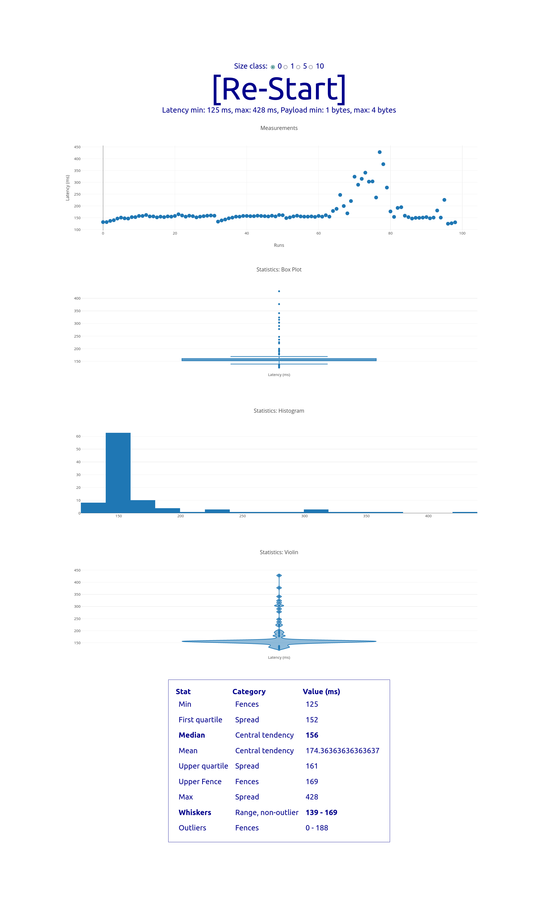

# End-to-end Fluid / Shared Tree Benchmark

Shared tree operation speed benchmark. Evaluating the end-to-end latency associated w/ the roundtrip, for both local (ie. [Tinylicious](https://github.com/microsoft/FluidFramework/tree/main/server/tinylicious)) and remote (ie. [Fluid](https://docs.microsoft.com/en-us/azure/azure-fluid-relay/)) relay services. Multiple payload classes are evaluated, from simple numbers to synthetic metrology data.

Uses behind the scenes the [shared-tree-map](https://github.com/dstanesc/shared-tree-map) library which is a thin wrapper around Microsoft's [@fluid-experimental/tree2](https://www.npmjs.com/package/@fluid-experimental/tree2)

## Fluid Relay Env Setup

```bash
export FLUID_MODE=frs
export SECRET_FLUID_RELAY=https://us.fluidrelay.azure.com
export SECRET_FLUID_TOKEN=xyz
export SECRET_FLUID_TENANT=xyz
```

## Tinylicious Env Setup

```bash
export FLUID_MODE=tiny
```

## Start

When using local relay, start the `tinylicious` service

```
npx tinylicious
```

```
npm run clean // optional
npm install
npm run build
npm start
```

## Example Results

Local (Tinylicious)


Remote (FRS, EU)

